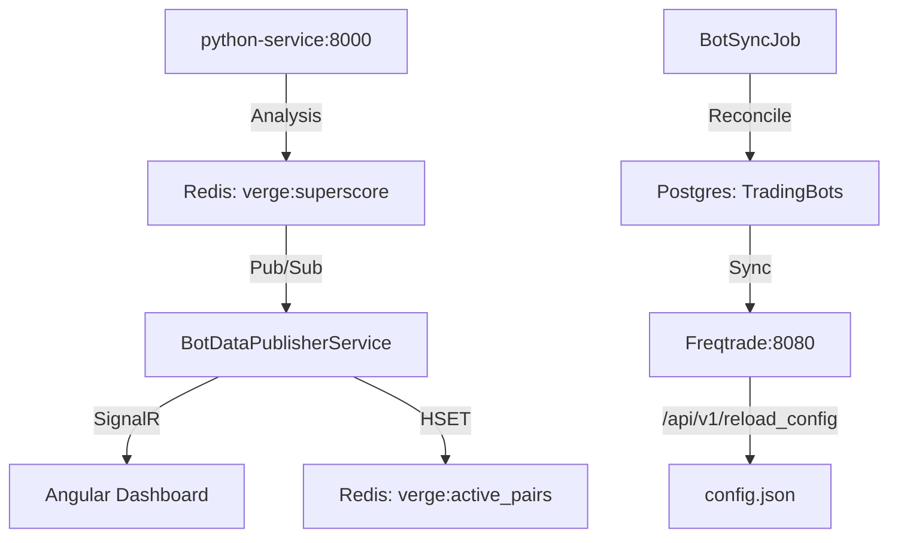

# Reglas de Arquitectura ABP Framework y DDD

Al trabajar en el proyecto Verge, es **OBLIGATORIO** respetar la arquitectura ABP y Domain-Driven Design (DDD). Nunca rompas este flujo arquitectónico.

## 1. Nunca bypassear el Backend
**El frontend (Angular) NUNCA debe comunicarse directamente con APIs externas de terceros** o contenedores internos aislados (como el de Freqtrade, Binance, etc.).

## 2. Flujo de Trabajo Obligatorio
Si necesitas integrar una nueva API o servicio:
1. **Modelos (C#):** Crea los DTOs y Requests/Responses en la capa `Application.Contracts` (o equivalente) del backend en .NET.
2. **Interfaz de Servicio (C#):** Define un `I[Nombre]AppService` en `Application.Contracts`.
3. **Implementación (C#):** Implementa el servicio `[Nombre]AppService` en la capa `Application`. Desde allí invocas al servicio externo (ej. Freqtrade API usando HttpClientFactory).
4. **Proxy (Angular):** Una vez que compila y corre el backend, asegúrate de correr el generador de proxy del lado de Angular.
   - Comando habitual: `abp generate-proxy -t ng`
5. **Uso en Frontend (TypeScript):** Consumir el servicio proxy generado (`[Nombre]Service`) e invocar los métodos desde allí, tipados estáticamente.

## 3. Interfaces en TypeScript
Nunca escribas interfaces a mano en el Frontend (`src/app/services/*.models.ts`) si su única función es mapear servicios del backend. Deja que `abp generate-proxy` se encargue de esto para garantizar que la API de .NET y Angular estén siempre sincronizadas y mantengan el contrato.

## ⚠️ REGLA CRÍTICA: Python AI Service (puerto 8000)

**NUNCA modifiques la infraestructura del python-service sin leer esto primero.**

El servicio Python de IA (`python-service/main.py`) **SIEMPRE corre como contenedor Docker**, NO como proceso local.
- El contenedor se llama: `verge-python-ai`
- Puerto: `0.0.0.0:8000->8000/tcp`
- Este contenedor puede llevar días corriendo y respondiendo 200 OK aunque no se vea actividad en consola local.

### Verificación rápida (antes de asumir que está roto):
```bash
docker logs verge-python-ai --tail 50
docker ps --filter "publish=8000"
```

### Reglas de oro:
1. **NUNCA pares ni elimines el contenedor `verge-python-ai` sin confirmación explícita del usuario.**
2. **Si el usuario ejecuta `python main.py` localmente, el proceso levanta pero Docker ya tiene el puerto 8000 tomado.** Los requests siguen llegando al contenedor — eso es correcto y esperado.
3. **Si necesitas actualizar el código del servicio**, debes hacer `docker build` y `docker restart verge-python-ai`, NO simplemente editar el archivo local y asumir que se actualiza solo.
4. **El `.NET backend** (`MarketScannerService`) llama al contenedor Docker via `http://localhost:8000` (o una URL configurada en `appsettings.json`). Ese target nunca debe cambiar sin actualizar también la config del backend.
5. **Si hay múltiples procesos en el puerto 8000** (verificar con `netstat -ano | findstr ":8000"`), es NORMAL que Docker (`com.docker.backend`, `wslrelay`) aparezca — es la plomería interna de Windows/WSL. Solo preocuparse si el contenedor `verge-python-ai` NO aparece en `docker ps`.

## ⚠️ REGLA CRÍTICA: Freqtrade Bot Integration (puerto 8080)

**NO modifiques la lógica de FreqtradeAppService ni el `config.json` del bot sin entender el flujo granular.**

1. **Multi-Bot Virtual:** El sistema simula control individual de pares (Play/Pause/Delete) manipulando dinámicamente la `pair_whitelist` y `pair_blacklist` del `config.json` y disparando `/api/v1/reload_config`.
2. **Persistence:** Los cambios se escriben directamente en el archivo JSON físico en `freqtrade/user_data/config.json`. Cualquier agente que quiera agregar lógica debe usar `JsonNode` para no romper el esquema.
3. **Control del Motor:** 
   - El botón **Play** llama a `/api/v1/start`.
   - El botón **Stop** llama a `/api/v1/stop`.
   - El botón **Delete** remueve el par de AMBAS listas (blanca y negra) para evitar efectos "zombie".
4. **Sincronización:** El backend detecta qué pares están abiertos consultando `/api/v1/status`. Nunca cambies esto a `/api/v1/trades` para estados en vivo (el historial es solo para visualización).
5. **Chart Markers:** El Super Gráfico inyecta marcadores de compra/venta usando la propiedad `setMarkers` de Lightweight Charts tras obtener el historial del backend. No borres esta lógica al actualizar el componente de gráficos.

---

## 🚨 ADVERTENCIA CRÍTICA #1: Freqtrade `GetStatusAsync` — El campo `exchange` puede ser STRING

**Antes de modificar `FreqtradeAppService.GetStatusAsync()`, lee esto.**

La respuesta de Freqtrade `/api/v1/show_config` devuelve a veces `"exchange"` como un **string** (nombre del exchange), no como un objeto JSON con propiedades.

```csharp
// ❌ NUNCA hagas esto — explota con InvalidOperationException en runtime
if (result.TryGetProperty("exchange", out var exch)) ExtractFromElement(exch);

// ✅ SIEMPRE guardá el ValueKind antes de procesarlo como objeto
if (result.TryGetProperty("exchange", out var exch) && exch.ValueKind == JsonValueKind.Object)
    ExtractFromElement(exch);
```

**Síntoma si se rompe:** El bot siempre aparece como "stopped" en la UI aunque Freqtrade esté corriendo. Los logs muestran `[Freqtrade] Error fatal en GetStatusAsync` con `InvalidOperationException: The requested operation requires an element of type 'Object', but the target element has type 'String'`.

---

## 🚨 ADVERTENCIA CRÍTICA #2: La Tabla del Scanner y el Bot usan pipelines de datos SEPARADOS

**El Scanner del Dashboard y las alertas SignalR NO son el mismo flujo. NO son intercambiables.**

```
[MarketScannerService]
    │
    ├─► Redis PUBLISH "verge:superscore"          ← ALIMENTA LA TABLA DEL DASHBOARD
    │       └─► BotDataPublisherService (subscribe)
    │               └─► Redis HSET "verge:active_pairs"
    │                       └─► BotAppService.GetActivePairsAsync()
    │                               └─► Tabla Scanner del Dashboard
    │
    └─► EventBus (AlertStateChangedEto)            ← ALIMENTA LOS TOASTS/ALERTAS
            └─► AlertStateChangedEventHandler
                    └─► SignalR TradingHub "ReceiveAlert"
                            └─► Notificaciones / toasts en el frontend
```

**Reglas:**
1. **Si la tabla del Scanner muestra pocas monedas o ninguna** → el `MarketScannerService` NO está publicando en Redis `verge:superscore`.
2. **Si las alertas/toasts no llegan** → el `EventBus` o `SignalR` está roto, NO el scanner.
3. **NUNCA elimines el `Redis PUBLISH "verge:superscore"`** del scanner para "simplificar" — vaciaría la tabla del dashboard.
4. **El threshold de confianza (>= 40) aplica solo al EventBus.** El publish a Redis `verge:superscore` debe ocurrir para TODOS los símbolos analizados (sujeto a revisión futura de performance).

**Por qué parece que "arreglar uno rompe el otro":** Los dos bugs son siempre independientes y preexistentes. La percepción de causalidad es falsa — es coincidencia de timing al verificar el estado del sistema.

---

## 🚨 ADVERTENCIA CRÍTICA #3: Semáforo Global de Binance API en MarketDataManager

El `MarketDataManager` tiene un semáforo `static` que limita los REST calls concurrentes a Binance:

```csharp
private static readonly SemaphoreSlim _binanceGate = new(5, 5); // Max 5 concurrent
```

- Es `static` → compartido entre TODOS los scoped instances del proceso.
- Protege la cuenta Binance de errores **429 Too Many Requests** que crashean el Bot.
- **No lo elimines, no lo aumentes a más de 10.** Si el Scanner necesita más velocidad, reducí el `Take(50)` de símbolos, no el semáforo.

## 🚨 ADVERTENCIA CRÍTICA #4: Persistencia y Sincronización de DB (Puerto 5433)

**NUNCA modifiques la base de datos sin considerar el `BotSyncJob` y el puerto configurado.**

1. **Fuente de Verdad Dual:**
   - Para el motor (Freqtrade), la verdad es el `config.json`.
   - Para la UI de Verge, la verdad es la tabla `TradingBots` en PostgreSQL.
2. **Sincronización Bidireccional (`BotSyncJob`):**
   - El job corre cada 2 minutos. 
   - **Discovery:** Si hay un par en Freqtrade que no está en la DB, lo importa automáticamente.
   - **Re-injection:** Si hay un bot `IsActive` en la DB que falta en Freqtrade, lo vuelve a inyectar llamando a `StartBotAsync`.
3. **Puerto de Postgres:** 
   - El puerto estándar configurado y estable es el **5433**. No intentes "corregirlo" a 5432 sin verificar primero con `netstat` si el servicio está escuchando allí, o romperás la conexión del backend.
4. **Modificación de Bots:** 
   - Cualquier cambio en la estrategia o parámetros de un bot debe hacerse a través de `IRepository<TradingBot, Guid>` para que el sincronizador lo propague al motor.

---

## 5. El Gran Mapa de Datos (Data Flow)


